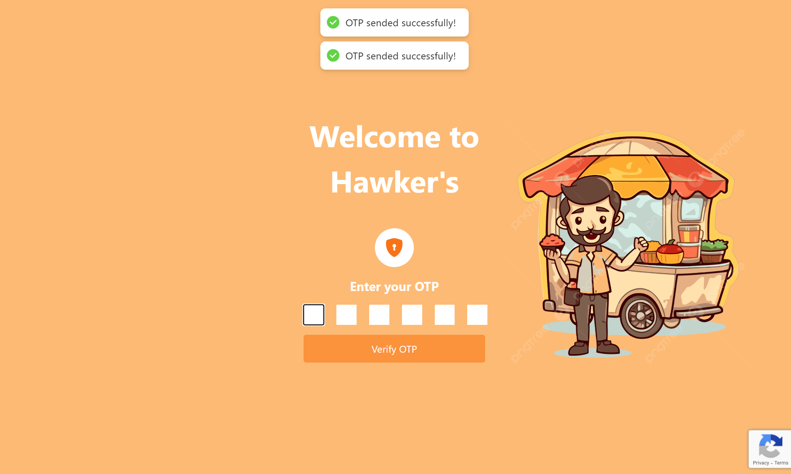
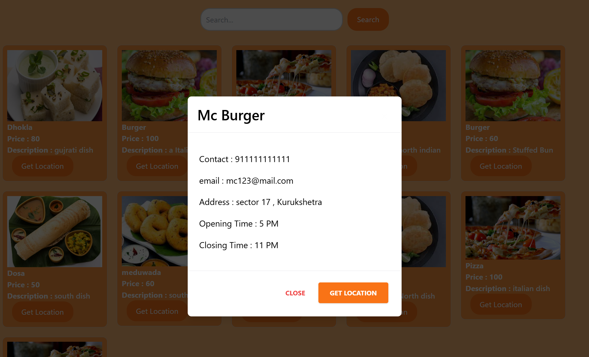
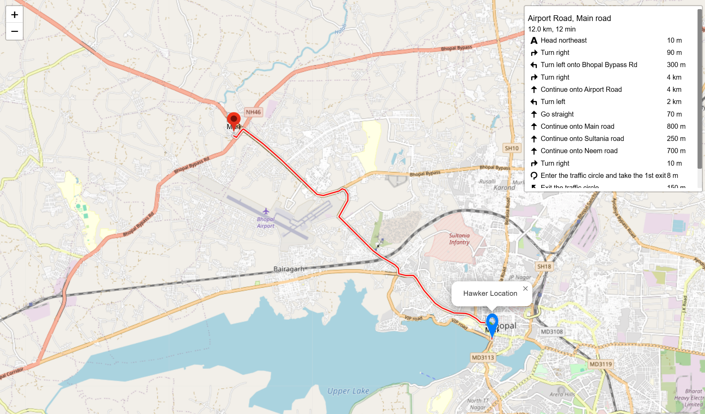
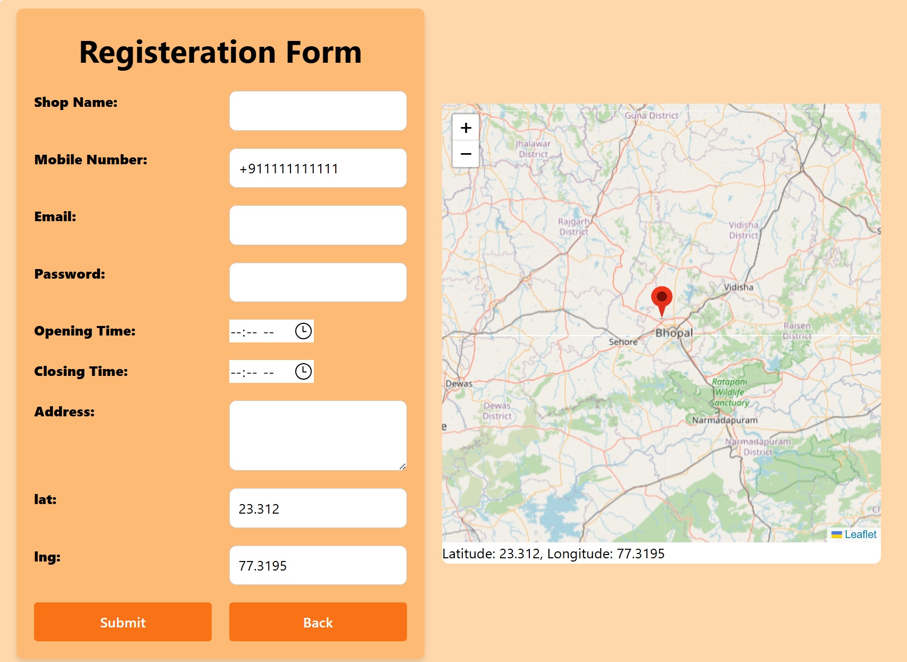

# Hawker

Hawker is a platform designed to connect hawkers with customers. The purpose of the platform is to allow hawkers to register and add their menu, prices, and location. This information will be displayed to customers, providing them with details about the hawkers in their vicinity. Additionally, the platform will offer a route from the customer's current location to the hawker, making it easier for customers to find and buy from hawkers.


## Screenshots











## Installation

Install forntend with npm

```bash
  npm install
```
Install backend with npm

```bash
  npm install
```
    
## Run Locally

Start the frontend server

```bash
  npm start
```

Start the backend server

```bash
  node index.js
```

